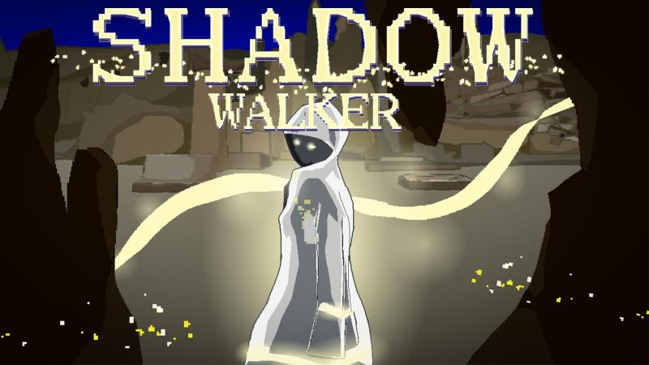

# Shadow Walker

A 2D puzzle-platform game built using Unity and C#. A game of light and shadow. Demo video can be found [here](https://www.youtube.com/watch?v=hAaSOzBULIs).

## Core Mechanism

Light is the key component of our game. 

By capturing, moving and placing **light**, players can realize effects such as creating shadows, illuminating the environment, and controlling machinery to solve puzzles. 

If the character stays in the dark/shadow for too long, and his entire body is immersed in the darkness, he will be injured. He will die if he continues to remain in the current state after certain amount of time. 

## Setup

- Developed on **Unity 2020.3.21f1c1**
- Used CodeMonkey packages [link](https://unitycodemonkey.com/utils.php)

